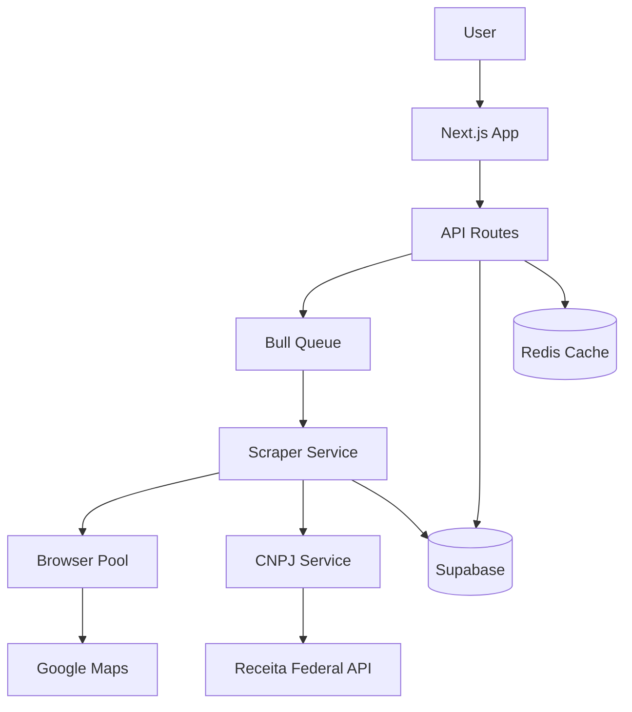

# 🏗️ DIAGNÓSTICO TÉCNICO COMPLETO - { spec64 }

**Data do Diagnóstico:** 28 de novembro de 2025  
**Arquiteto Responsável:** GitHub Copilot (Claude Sonnet 4.5)  
**Status do Projeto:** MVP Funcional mas Frágil  
**Nota Geral:** 5/10 (Produção-ready: ❌)

---

## 📋 1. VISÃO GERAL DO PROJETO

### Fluxo do Sistema (Ponta a Ponta)

```
USUÁRIO → Next.js (3000)
           ↓
   [Interface conversacional]
           ↓
   POST /api/search/create
           ↓
   [Cria registro "processing"]
           ↓
   Background: processSearch()
           ↓
   HTTP → Playwright Scraper (3001)
           ↓
   [Google Maps scraping]
           ↓
   [Opcional: CNPJ extraction]
           ↓
   [Opcional: Receita Federal API]
           ↓
   Grava em Supabase (PostgreSQL)
           ↓
   Update status → "completed"
           ↓
   Frontend: polling /api/search/[id]
           ↓
   ResultsTable renderiza dados
```

### Estrutura do Projeto

```
novo/
├── apps/
│   └── web/                           # Next.js app principal
│       ├── app/
│       │   ├── home/scout/chat/      # Interface de busca
│       │   └── api/                   # Rotas API
│       └── components/
├── packages/
│   ├── features/kaix-scout/          # Módulo de busca (hooks, services, types)
│   ├── ui/                            # Shadcn components
│   ├── supabase/                      # Cliente Supabase
│   └── auth/                          # Autenticação
└── projeto-google-find/server/       # ⚠️ FORA DO MONOREPO
    ├── index-ultra-fast.js           # Scraper Playwright
    ├── cnpj-scraper.js               # CNPJ extraction
    └── cnpj-enrichment.js            # Receita Federal API
```

**⚠️ PROBLEMA CRÍTICO:** Scraper completamente fora do monorepo

---

## 🎨 2. DIAGNÓSTICO DO FRONTEND

### ✅ O QUE ESTÁ BOM

1. **Arquitetura Next.js 15 moderna**
   - App Router corretamente implementado
   - React 19 com Server Components
   - Turbopack configurado para dev

2. **Estado gerenciado com TanStack Query**
   - `useSearch`, `useSearchList`, `useCreateSearch` bem estruturados
   - Polling inteligente (para enquanto status !== "processing")
   - Cache e invalidação corretos

3. **Design System consistente**
   - Shadcn UI bem integrado
   - Tailwind v4 funcionando
   - Motion para animações

4. **Separação de responsabilidades**
   - `packages/features/kaix-scout` isola lógica de negócio
   - Types centralizados em `src/types`

### ⚠️ O QUE ESTÁ FRÁGIL

#### 1. ResultsTable é um componente monstruoso (1000+ linhas)

**Arquivo:** `apps/web/app/home/scout/chat/_components/results-table.tsx`

```tsx
// 1000+ LINHAS misturando:
// - Rendering
// - Lógica de imagens
// - Análise de sentimento
// - Formatação CNPJ
// - Extração WhatsApp
```

**Problema:** Impossível de testar, debugar ou reusar  
**Impacto:** Qualquer mudança quebra múltiplas features  
**Prioridade:** 🔴 ALTA

#### 2. Acoplamento direto com API externa no service

**Arquivo:** `packages/features/kaix-scout/src/services/google-maps-scraper.service.ts`

```typescript
const SCRAPER_URL = process.env.GOOGLE_MAPS_SCRAPER_URL || 'http://localhost:3001';

export async function searchPlaces(params: SearchParams): Promise<ScraperResponse> {
  const response = await fetch(`${SCRAPER_URL}/api/scrape-maps`, {
    method: 'POST',
    headers: { 'Content-Type': 'application/json' },
    body: JSON.stringify(requestBody),
  });
}
```

**Problema:** 
- Hardcoded URL
- Zero abstração
- Sem retry logic
- Sem timeout configurável

**Impacto:** Difícil mudar de provider ou adicionar resiliência  
**Prioridade:** 🟠 MÉDIA

#### 3. Tipos duplicados/inconsistentes

```typescript
// GoogleMapsPlace vs Place vs Company
// 3 tipos diferentes representando a mesma coisa em camadas diferentes
```

**Problema:** Cast manual entre tipos, perda de type safety  
**Impacto:** Bugs em runtime que TypeScript não pega  
**Prioridade:** 🟡 BAIXA

#### 4. Zero tratamento de erro visual

**Arquivo:** `apps/web/app/home/scout/chat/page.tsx`

```tsx
export default function ChatPage() {
  const searchParams = useSearchParams();
  const conversationId = searchParams.get('c');
  
  // ⚠️ Sem error boundary
  // ⚠️ Sem fallback UI
  // ⚠️ Apenas console.error
}
```

**Problema:** Usuário não sabe se deu erro ou está carregando  
**Impacto:** UX horrível quando API cai  
**Prioridade:** 🔴 ALTA

#### 5. Polling sem timeout/max retries

**Arquivo:** `packages/features/kaix-scout/src/hooks/use-search.ts`

```typescript
refetchInterval: (query) => {
  const data = query.state.data;
  if (data?.search.status === 'processing') {
    return 3000; // ⚠️ INFINITO - sem timeout
  }
  return false;
}
```

**Problema:** Se backend travar em "processing", frontend poll forever  
**Impacto:** Memory leak, requests infinitos  
**Prioridade:** 🔴 CRÍTICA

### 🔥 GAMBIARRAS CRÍTICAS

1. **"use client" em TUDO**
   - Não aproveita Server Components do Next.js 15
   - Tudo roda no cliente, aumenta bundle size

2. **Lógica complexa dentro de componentes**
   - Análise de sentimento dentro do CompanyItem
   - Deveria estar em hooks separados

3. **Imagens sem otimização**
   - Não usa `next/image` corretamente
   - Carrega 10 imagens full-size do Google

---

## ⚙️ 3. DIAGNÓSTICO DO BACKEND/SCRAPER

### ✅ O QUE ESTÁ BEM FEITO

1. **Scraper V3 ultra-otimizado**
   - Playwright ao invés de Puppeteer (correto)
   - Processamento paralelo em lotes de 3
   - Dual-extraction (JSON + DOM fallback)

2. **CNPJ Scraper com 3 estratégias**
   - Google Search + Maps + Website
   - Validação de dígitos verificadores

3. **Rate limiting implementado**
   ```javascript
   const RATE_LIMIT_MS = 60000; // 1 req/min
   ```

### ⚠️ O QUE ESTÁ MUITO ERRADO

#### 1. SCRAPER COMPLETAMENTE FORA DO MONOREPO

```
novo/                    ← Monorepo Turborepo
projeto-google-find/     ← ⚠️ PASTA SEPARADA
```

**Problema:** 
- Zero integração
- Deploy manual sempre
- Types não compartilhados
- Duas bases de código separadas

**Impacto:** Quando escalar, vai precisar reescrever tudo  
**Prioridade:** 🔴 CRÍTICA

#### 2. processSearch() executa no request handler

**Arquivo:** `apps/web/app/api/search/create/route.ts`

```typescript
export async function POST(request: NextRequest) {
  // ... validações ...
  
  // Cria registro no banco
  const { data: search } = await supabase.from('searches').insert({...}).select().single();
  
  // ⚠️ "Fire and forget" sem queue, sem retry
  processSearch(search.id, searchParams).catch((error) => {
    console.error('[API] Background search processing error:', error);
  });
  
  return NextResponse.json({ data: { searchId: search.id } });
}

async function processSearch(searchId: string, params: SearchParams) {
  // Chama scraper
  // Grava no banco
  // Se cair no meio, PERDE TUDO
}
```

**Problema:** 
- "Fire and forget" sem garantias
- Se cair no meio, perde dados
- Zero observabilidade
- Sem retry automático

**Impacto:** Confiabilidade zero quando escalar  
**Prioridade:** 🔴 CRÍTICA

#### 3. Sem sistema de jobs/workers

- Background processing é apenas `.catch()`
- Não tem: BullMQ, Redis, RabbitMQ, nada
- Processamento bloqueante

**Impacto:** Não aguenta mais que 5 usuários simultâneos  
**Prioridade:** 🔴 CRÍTICA

#### 4. API do scraper sem autenticação

**Arquivo:** `projeto-google-find/server/index-ultra-fast.js`

```javascript
app.post('/api/scrape-maps', async (req, res) => {
  // ⚠️ ZERO AUTH
  const { query, city } = req.body;
  
  if (!query) {
    return res.status(400).json({ success: false, error: 'Query is required' });
  }
  
  // Rate limiting por IP (quebra atrás de proxy)
  const clientIP = req.ip || req.connection.remoteAddress;
  // ...
});
```

**Problema:** 
- Qualquer um pode chamar e derrubar o servidor
- Rate limit por IP quebra atrás de proxy (Vercel/Nginx)

**Impacto:** DDoS trivial, custos explodindo  
**Prioridade:** 🔴 CRÍTICA

#### 5. Enriquecimento Receita Federal síncrono

**Arquivo:** `projeto-google-find/server/index-ultra-fast.js`

```javascript
if (enrichWithCNPJ) {
  await cnpjScraper.findCNPJ(); // ⚠️ BLOQUEIA POR 24-48s
  
  // Enriquece em lote (síncrono)
  const enrichedData = await enrichmentService.enrichBatch(cnpjs);
}
```

**Problema:** Request fica 30-50s travado  
**Impacto:** Timeout garantido quando escalar  
**Prioridade:** 🔴 ALTA

#### 6. Express standalone sem monitoramento

- Zero logs estruturados
- Sem healthcheck robusto
- Sem metrics (Prometheus, etc)
- Sem tracing

**Prioridade:** 🟠 MÉDIA

### 🔥 GAMBIARRAS CRÍTICAS

#### 1. Código JavaScript puro (não TypeScript)

**Arquivo:** `index-ultra-fast.js` - 700+ linhas SEM TYPES

```javascript
// JavaScript puro em 2025
// Impossível refatorar com segurança
```

**Impacto:** Refactoring é Russian Roulette  
**Prioridade:** 🔴 ALTA

#### 2. Rate limiting por IP no Express

```javascript
const clientIP = req.ip || req.connection.remoteAddress;
const now = Date.now();
const lastRequest = requestTimestamps.get(clientIP);
```

**Problema:** Atrás de proxy (Vercel/Nginx) sempre pega mesmo IP  
**Impacto:** Rate limit quebra completamente  
**Prioridade:** 🔴 ALTA

#### 3. Browser pool não gerenciado

```javascript
app.post('/api/scrape-maps', async (req, res) => {
  browser = await chromium.launch(); // Para cada request
  // ... usa browser ...
  await browser.close();
});
```

**Problema:** 
- Memory leak
- Demora 2-3s só para abrir browser
- 10 requests simultâneos = crash

**Impacto:** Sistema trava com carga  
**Prioridade:** 🔴 CRÍTICA

#### 4. Erro silenciado

```javascript
processSearch(search.id, searchParams).catch((error) => {
  console.error('[Background] Error:', error);
  // ⚠️ NOTHING ELSE - sem alertas, sem retry, sem nada
})
```

---

## 💾 4. DIAGNÓSTICO DO BANCO DE DADOS

### ✅ O QUE ESTÁ BOM

1. **Schema bem normalizado**
   - `searches` → `companies` corretamente
   - RLS policies implementadas

2. **Índices básicos criados**
   ```sql
   CREATE INDEX idx_searches_user_id ON searches(user_id);
   CREATE INDEX idx_companies_place_id ON companies(place_id);
   ```

3. **JSONB para dados flexíveis**
   - `categories`, `qsa`, `top_reviews` em JSONB (correto)

### ⚠️ O QUE VAI QUEBRAR QUANDO ESCALAR

#### 1. companies.cnpj SEM ÍNDICE

**Arquivo:** `migration-receita-fields.sql`

```sql
-- ⚠️ Campo criado mas SEM INDEX
ALTER TABLE companies ADD COLUMN IF NOT EXISTS cnpj TEXT;

-- Índices criados para outros campos:
CREATE INDEX IF NOT EXISTS idx_companies_razao_social ON companies(razao_social) WHERE razao_social IS NOT NULL;
CREATE INDEX IF NOT EXISTS idx_companies_situacao_cadastral ON companies(situacao_cadastral);

-- MAS FALTA:
-- CREATE INDEX idx_companies_cnpj ON companies(cnpj) WHERE cnpj IS NOT NULL;
```

**Problema:** Buscas por CNPJ vão fazer full table scan  
**Impacto:** 100k+ registros = queries de 10s+  
**Prioridade:** 🔴 CRÍTICA

**Fix:**
```sql
CREATE INDEX IF NOT EXISTS idx_companies_cnpj ON companies(cnpj) WHERE cnpj IS NOT NULL;
```

#### 2. Sem particionamento

- Tabela `companies` vai ter milhões de linhas
- Todas queries vão degradar linearmente
- Backup/restore cada vez mais lento

**Impacto:** Queries lentas com volume  
**Prioridade:** 🟠 ALTA

**Fix sugerido:**
```sql
-- Particionar por created_at (mensal)
CREATE TABLE companies_2025_01 PARTITION OF companies 
  FOR VALUES FROM ('2025-01-01') TO ('2025-02-01');
```

#### 3. searches.results em JSONB não existe

**Documentação menciona:** "Resultados completos em JSONB (cache inteligente)"

**Realidade:**
```sql
-- NÃO EXISTE NO SCHEMA
-- searches table não tem campo "results"
```

**Problema:** Documentação mente, precisa re-scrape sempre  
**Impacto:** Performance ruim, custos altos  
**Prioridade:** 🟡 MÉDIA

**Fix:**
```sql
ALTER TABLE searches ADD COLUMN results JSONB DEFAULT NULL;
CREATE INDEX idx_searches_results ON searches USING gin(results) WHERE results IS NOT NULL;
```

#### 4. Sem soft delete

```sql
-- Deleta hard sempre
-- Zero auditoria
-- Sem histórico de exclusões
```

**Impacto:** Não pode recuperar dados apagados  
**Prioridade:** 🟡 BAIXA

**Fix:**
```sql
ALTER TABLE companies ADD COLUMN deleted_at TIMESTAMP;
CREATE INDEX idx_companies_active ON companies(deleted_at) WHERE deleted_at IS NULL;
```

#### 5. Campos da Receita Federal mal indexados

```sql
CREATE INDEX idx_companies_razao_social ON companies(razao_social) WHERE razao_social IS NOT NULL;
```

**Problema:** Partial index em TEXT sem collation  
**Impacto:** Buscas case-sensitive quebram  
**Prioridade:** 🟡 BAIXA

### 🔥 PROBLEMAS DE MODELAGEM

#### 1. companies sem user_id direto

```sql
-- Arquitetura atual:
companies → search_id → searches → user_id

-- Queries precisam de JOIN triplo:
SELECT c.* 
FROM companies c
INNER JOIN searches s ON c.search_id = s.id
WHERE s.user_id = 'xxx';
```

**Problema:** JOIN triplo para pegar empresas do usuário  
**Impacto:** Queries lentas, RLS policies complexas  
**Prioridade:** 🟠 MÉDIA

**Fix:**
```sql
ALTER TABLE companies ADD COLUMN user_id UUID REFERENCES accounts(id);
CREATE INDEX idx_companies_user_id ON companies(user_id);
```

#### 2. Dados do Google Maps + Receita Federal na mesma tabela

- 53 colunas na mesma tabela
- 27 campos Google Maps
- 26 campos Receita Federal
- Metade NULL sempre

**Problema:** Row size gigante, desperdício de espaço  
**Impacto:** Scans lentos, backup pesado  
**Prioridade:** 🟡 MÉDIA

**Fix sugerido:**
```sql
-- Normalizar:
CREATE TABLE companies_google_data (
  company_id UUID PRIMARY KEY REFERENCES companies(id),
  -- 27 campos Google Maps
);

CREATE TABLE companies_receita_data (
  company_id UUID PRIMARY KEY REFERENCES companies(id),
  -- 26 campos Receita Federal
);
```

#### 3. Sem tabela de histórico de enriquecimento

- Se Receita Federal atualizar dados, perde histórico
- Não sabe quando foi última atualização
- Não rastreia mudanças

**Prioridade:** 🟡 BAIXA

#### 4. place_id não é unique global

```sql
CREATE UNIQUE INDEX idx_companies_place_id ON companies(place_id);
```

**Problema:** 
- Unique apenas dentro de uma busca
- Permite duplicatas entre searches diferentes
- Mesma empresa aparece 10x no banco

**Impacto:** Dados duplicados, queries ruins  
**Prioridade:** 🟠 MÉDIA

**Fix:**
```sql
-- Remover índice atual e recriar global
DROP INDEX idx_companies_place_id;
CREATE UNIQUE INDEX idx_companies_place_id_global ON companies(place_id);
```

---

## 🧹 5. QUALIDADE DE CÓDIGO

### Nível: **MÉDIA-BAIXA** (5/10)

### Problemas Principais

#### 1. Zero testes
- Nem unit, nem integration, nem E2E
- Impossível refatorar com segurança
- Cada mudança é um salto de fé

**Prioridade:** 🔴 ALTA

#### 2. Mistura de padrões
- JavaScript no scraper
- TypeScript no Next.js
- Sem lint rules compartilhadas
- Sem code style consistency

**Prioridade:** 🟡 BAIXA

#### 3. Comentários em português

```javascript
// ✅ Adiciona todos os campos da Receita Federal
// ⚡ 2-3 segundos para 12 lugares
```

**Problema:** Código internacional com docs localizadas  
**Prioridade:** 🟡 BAIXA

#### 4. README desatualizado

- Menciona TanStack Table mas não é usado de verdade
- Instruções de deploy quebradas
- Comandos desatualizados

**Prioridade:** 🟡 BAIXA

#### 5. Sem CI/CD

- Zero automation
- Deploy manual
- Sem testes automáticos
- Sem quality gates

**Prioridade:** 🟠 MÉDIA

#### 6. Logs não estruturados

```javascript
console.log('✅ JSON');
console.log('🔄 DOM');
console.log(`📊 CNPJs encontrados: ${cnpjCount}/${businesses.length}`);
```

**Problema:** 
- Emojis em prod
- Impossível parsear logs
- Sem structured logging
- Difícil debugar produção

**Prioridade:** 🟠 MÉDIA

**Fix:**
```typescript
// Usar Pino ou Winston
import pino from 'pino';

const logger = pino({
  level: 'info',
  transport: { target: 'pino-pretty' }
});

logger.info({ method: 'json', success: true }, 'Data extracted');
logger.error({ error: err.message, stack: err.stack }, 'Scraping failed');
```

---

## 🚨 6. RISCOS CRÍTICOS - "SE NÃO ARRUMAR AGORA, VAI DOER"

### 🔴 CRÍTICO (Quebra em produção)

#### 1. Scraper não aguenta concorrência
- Browser pool zero gerenciamento
- 5 requests simultâneos = crash
- Memory leak garantido

**Ação:** Implementar browser pool + queue AGORA

```typescript
// playwright-pool.ts
import { chromium, Browser } from 'playwright';

class BrowserPool {
  private browsers: Browser[] = [];
  private maxSize: number;
  
  constructor(maxSize = 3) {
    this.maxSize = maxSize;
  }
  
  async acquire(): Promise<Browser> {
    if (this.browsers.length < this.maxSize) {
      const browser = await chromium.launch({ headless: true });
      this.browsers.push(browser);
      return browser;
    }
    // Wait for available browser
    await new Promise(resolve => setTimeout(resolve, 1000));
    return this.acquire();
  }
  
  async release(browser: Browser) {
    // Keep browser alive for reuse
  }
}
```

#### 2. processSearch() sem retry/queue
- Perde dados se cair no meio
- Zero observabilidade
- Sem garantias de processamento

**Ação:** BullMQ + Redis imediato

```typescript
// jobs/scraping-queue.ts
import Queue from 'bull';

const scrapingQueue = new Queue('scraping', {
  redis: { host: 'localhost', port: 6379 }
});

scrapingQueue.process(async (job) => {
  const { searchId, params } = job.data;
  
  try {
    await processSearch(searchId, params);
  } catch (error) {
    // Retry automático via Bull
    throw error;
  }
});

// Em route.ts:
await scrapingQueue.add({ searchId: search.id, params });
```

#### 3. API scraper sem auth
- Qualquer um pode atacar
- DDoS trivial

**Ação:** JWT ou API keys imediato

```typescript
// middleware/auth.ts
import jwt from 'jsonwebtoken';

export function validateApiKey(req, res, next) {
  const apiKey = req.headers['x-api-key'];
  
  if (!apiKey || !jwt.verify(apiKey, process.env.JWT_SECRET)) {
    return res.status(401).json({ error: 'Unauthorized' });
  }
  
  next();
}

// index-ultra-fast.js:
app.post('/api/scrape-maps', validateApiKey, async (req, res) => {
  // ...
});
```

#### 4. Frontend polling infinito
- Memory leak garantido
- Requests sem fim

**Ação:** Timeout + max retries

```typescript
// use-search.ts
refetchInterval: (query) => {
  const data = query.state.data;
  const attempt = query.state.fetchFailureCount;
  
  // ✅ MAX 40 retries (2 minutos)
  if (attempt > 40) {
    console.error('Search timeout after 2 minutes');
    return false;
  }
  
  if (data?.search.status === 'processing') {
    return 3000;
  }
  
  return false;
}
```

### 🟠 ALTO (Vai explodir quando crescer)

#### 5. Scraper fora do monorepo
- Deploy manual sempre
- Types não compartilhados

**Ação:** Migrar para `apps/scraper` TypeScript

```
novo/
├── apps/
│   ├── web/
│   └── scraper/          # ← MIGRAR AQUI
│       ├── src/
│       │   ├── routes/
│       │   ├── services/
│       │   └── index.ts
│       └── package.json
```

#### 6. companies sem índice em cnpj
- Queries vão travar

**Ação:** `CREATE INDEX idx_companies_cnpj`

```sql
CREATE INDEX IF NOT EXISTS idx_companies_cnpj 
ON companies(cnpj) 
WHERE cnpj IS NOT NULL;
```

#### 7. ResultsTable 1000+ linhas
- Impossível manter

**Ação:** Quebrar em 10+ componentes

```
results-table.tsx (1000 linhas)
↓
├── CompanyCard.tsx (150 linhas)
├── CompanyDetails.tsx (200 linhas)
├── ReviewsAnalysis.tsx (150 linhas)
├── ReviewsSummary.tsx (100 linhas)
├── ImageGallery.tsx (80 linhas)
└── ActionButtons.tsx (50 linhas)
```

#### 8. Sem particionamento DB
- 1M+ registros = lento

**Ação:** Partition por created_at

```sql
-- Converter para particionada
CREATE TABLE companies_partitioned (
  LIKE companies INCLUDING ALL
) PARTITION BY RANGE (created_at);

CREATE TABLE companies_2025_11 PARTITION OF companies_partitioned
  FOR VALUES FROM ('2025-11-01') TO ('2025-12-01');
```

### 🟡 MÉDIO (Dívida técnica)

#### 9. Zero testes
- Medo de mexer

**Ação:** Vitest + testes críticos

```typescript
// use-search.test.ts
import { renderHook, waitFor } from '@testing-library/react';
import { useSearch } from './use-search';

describe('useSearch', () => {
  it('should poll until completed', async () => {
    const { result } = renderHook(() => useSearch('search-id'));
    
    await waitFor(() => {
      expect(result.current.data?.search.status).toBe('completed');
    });
  });
});
```

#### 10. Logs não estruturados
- Impossível debugar prod

**Ação:** Pino logger + JSON

```typescript
import pino from 'pino';

const logger = pino({
  level: process.env.LOG_LEVEL || 'info',
});

logger.info({ searchId, query }, 'Search started');
logger.error({ error: err.message }, 'Scraping failed');
```

#### 11. Tipos duplicados
- Cast manual everywhere

**Ação:** Unificar types

```typescript
// @kit/types/company.ts
export interface Company {
  // União de GoogleMapsPlace + ReceitaFederalData + Company
  id: string;
  place_id: string;
  name: string;
  // ... todos campos unificados
}
```

#### 12. Sem soft delete
- Zero auditoria

**Ação:** `deleted_at` column

```sql
ALTER TABLE companies ADD COLUMN deleted_at TIMESTAMP;
ALTER TABLE searches ADD COLUMN deleted_at TIMESTAMP;
```

---

## 🗓️ 7. ROADMAP TÉCNICO 15-30 DIAS

### Semana 1: Estabilização Backend

**Objetivo:** Backend aguenta 50+ usuários simultâneos

#### Dia 1-2: Migrar scraper para TypeScript
```
ANTES:
projeto-google-find/server/index-ultra-fast.js (700 linhas JS)

DEPOIS:
apps/scraper/
├── src/
│   ├── routes/
│   │   └── scrape.route.ts
│   ├── services/
│   │   ├── google-maps.service.ts
│   │   ├── cnpj.service.ts
│   │   └── receita.service.ts
│   ├── types/
│   │   └── index.ts
│   └── index.ts
└── package.json
```

**Benefícios:**
- Type safety completo
- Compartilha types com frontend
- Deploy integrado no monorepo

#### Dia 3-4: Implementar job queue
```typescript
// apps/scraper/src/queue/scraping.queue.ts
import Queue from 'bull';

export const scrapingQueue = new Queue('scraping', {
  redis: process.env.REDIS_URL,
  settings: {
    maxStalledCount: 3,
    stalledInterval: 30000,
  }
});

scrapingQueue.process(5, async (job) => {
  const { searchId, params } = job.data;
  
  await processSearchJob(searchId, params);
});

// apps/web/app/api/search/create/route.ts
await scrapingQueue.add(
  { searchId: search.id, params },
  { attempts: 3, backoff: 5000 }
);
```

**Benefícios:**
- Retry automático
- Observabilidade (Bull Board)
- Controle de concorrência

#### Dia 5: Browser pool gerenciado
```typescript
// apps/scraper/src/services/browser-pool.ts
import { chromium, Browser, BrowserContext } from 'playwright';

class BrowserPool {
  private pool: Browser[] = [];
  private inUse = new Set<Browser>();
  private readonly maxSize = 3;
  
  async acquire(): Promise<BrowserContext> {
    let browser = this.pool.find(b => !this.inUse.has(b));
    
    if (!browser) {
      if (this.pool.length < this.maxSize) {
        browser = await chromium.launch({ headless: true });
        this.pool.push(browser);
      } else {
        // Wait for available
        await new Promise(resolve => setTimeout(resolve, 1000));
        return this.acquire();
      }
    }
    
    this.inUse.add(browser);
    return browser.newContext();
  }
  
  async release(context: BrowserContext) {
    await context.close();
    const browser = this.pool.find(b => b.contexts().includes(context));
    if (browser) this.inUse.delete(browser);
  }
}

export const browserPool = new BrowserPool();
```

**Benefícios:**
- Reusa browsers (3x mais rápido)
- Controle de memória
- Concorrência limitada

#### Dia 6: Auth no scraper
```typescript
// apps/scraper/src/middleware/auth.ts
import jwt from 'jsonwebtoken';

export function validateJWT(req, res, next) {
  const token = req.headers.authorization?.replace('Bearer ', '');
  
  try {
    const payload = jwt.verify(token, process.env.JWT_SECRET);
    req.userId = payload.sub;
    next();
  } catch {
    res.status(401).json({ error: 'Unauthorized' });
  }
}

// apps/web/app/api/search/create/route.ts
const token = jwt.sign({ sub: user.id }, process.env.JWT_SECRET);

await fetch(`${SCRAPER_URL}/api/scrape`, {
  headers: { Authorization: `Bearer ${token}` }
});
```

#### Dia 7: Logs estruturados
```typescript
// apps/scraper/src/lib/logger.ts
import pino from 'pino';

export const logger = pino({
  level: process.env.LOG_LEVEL || 'info',
  transport: process.env.NODE_ENV === 'development' 
    ? { target: 'pino-pretty' }
    : undefined
});

// Uso:
logger.info({ searchId, query, userId }, 'Search started');
logger.error({ err, searchId }, 'Scraping failed');
```

### Semana 2: Database & Performance

**Objetivo:** Queries rápidas mesmo com 100k+ empresas

#### Dia 8: Adicionar índices críticos
```sql
-- Script: migrations/add-critical-indexes.sql

-- CNPJ (mais importante)
CREATE INDEX IF NOT EXISTS idx_companies_cnpj 
ON companies(cnpj) 
WHERE cnpj IS NOT NULL;

-- Queries por usuário
CREATE INDEX IF NOT EXISTS idx_companies_user_search 
ON companies(search_id, created_at DESC);

-- Filtros comuns
CREATE INDEX IF NOT EXISTS idx_companies_rating 
ON companies(rating) 
WHERE rating IS NOT NULL;

CREATE INDEX IF NOT EXISTS idx_companies_has_website 
ON companies(website) 
WHERE website IS NOT NULL;

-- ANALYZE para atualizar estatísticas
ANALYZE companies;
```

#### Dia 9-10: Normalizar tabela companies
```sql
-- Script: migrations/normalize-companies.sql

-- Nova tabela para dados Receita Federal
CREATE TABLE companies_receita (
  company_id UUID PRIMARY KEY REFERENCES companies(id) ON DELETE CASCADE,
  
  -- Identificação
  razao_social TEXT,
  nome_fantasia TEXT,
  situacao_cadastral TEXT,
  data_inicio_atividade DATE,
  
  -- Classificação
  porte_empresa TEXT,
  natureza_juridica TEXT,
  capital_social TEXT,
  
  -- CNAEs
  cnae_principal TEXT,
  cnaes_secundarios JSONB,
  
  -- Regime
  opcao_simples TEXT,
  opcao_mei TEXT,
  
  -- QSA
  qsa JSONB,
  
  -- Endereço
  receita_logradouro TEXT,
  receita_numero TEXT,
  receita_cep TEXT,
  receita_municipio TEXT,
  receita_uf TEXT,
  
  -- Meta
  receita_fetched_at TIMESTAMP WITH TIME ZONE,
  
  created_at TIMESTAMP WITH TIME ZONE DEFAULT NOW()
);

CREATE INDEX idx_companies_receita_company ON companies_receita(company_id);
CREATE INDEX idx_companies_receita_razao ON companies_receita(razao_social);

-- Migrar dados existentes
INSERT INTO companies_receita (company_id, razao_social, ...)
SELECT id, razao_social, ...
FROM companies
WHERE razao_social IS NOT NULL;

-- Remover colunas antigas (após validação)
-- ALTER TABLE companies DROP COLUMN razao_social;
-- ... etc
```

#### Dia 11: Implementar soft delete
```sql
-- Script: migrations/add-soft-delete.sql

ALTER TABLE companies ADD COLUMN deleted_at TIMESTAMP;
ALTER TABLE searches ADD COLUMN deleted_at TIMESTAMP;

CREATE INDEX idx_companies_active 
ON companies(deleted_at) 
WHERE deleted_at IS NULL;

CREATE INDEX idx_searches_active 
ON searches(deleted_at) 
WHERE deleted_at IS NULL;

-- Atualizar RLS policies
DROP POLICY IF EXISTS companies_read ON companies;
CREATE POLICY companies_read ON companies 
  FOR SELECT 
  TO authenticated 
  USING (
    deleted_at IS NULL AND
    search_id IN (
      SELECT id FROM searches 
      WHERE user_id = auth.uid() AND deleted_at IS NULL
    )
  );
```

#### Dia 12: Cache layer Redis
```typescript
// apps/web/lib/redis.ts
import Redis from 'ioredis';

export const redis = new Redis(process.env.REDIS_URL);

// apps/web/app/api/search/[searchId]/route.ts
export async function GET(req, { params }) {
  const { searchId } = params;
  
  // Check cache first
  const cached = await redis.get(`search:${searchId}`);
  if (cached) {
    return NextResponse.json(JSON.parse(cached));
  }
  
  // Fetch from DB
  const data = await supabase.from('searches').select('*').eq('id', searchId).single();
  
  // Cache for 30 minutes
  await redis.setex(`search:${searchId}`, 1800, JSON.stringify(data));
  
  return NextResponse.json(data);
}
```

#### Dia 13-14: Particionamento
```sql
-- Script: migrations/partition-companies.sql

-- Converter para particionada
CREATE TABLE companies_new (
  LIKE companies INCLUDING ALL
) PARTITION BY RANGE (created_at);

-- Criar partições mensais
CREATE TABLE companies_2025_11 PARTITION OF companies_new
  FOR VALUES FROM ('2025-11-01') TO ('2025-12-01');

CREATE TABLE companies_2025_12 PARTITION OF companies_new
  FOR VALUES FROM ('2025-12-01') TO ('2026-01-01');

-- Migrar dados (em lotes)
INSERT INTO companies_new SELECT * FROM companies LIMIT 10000;

-- Renomear (após validação)
-- ALTER TABLE companies RENAME TO companies_old;
-- ALTER TABLE companies_new RENAME TO companies;
```

### Semana 3: Frontend & UX

**Objetivo:** Interface robusta e testável

#### Dia 15-17: Refatorar ResultsTable
```typescript
// apps/web/app/home/scout/chat/_components/results/

// CompanyCard.tsx (150 linhas)
export function CompanyCard({ company }: { company: Company }) {
  return (
    <Collapsible>
      <CompanyHeader company={company} />
      <CollapsibleContent>
        <CompanyDetails company={company} />
      </CollapsibleContent>
    </Collapsible>
  );
}

// CompanyHeader.tsx (80 linhas)
export function CompanyHeader({ company }: { company: Company }) {
  return (
    <div className="flex items-center gap-4">
      <CompanyAvatar name={company.name} />
      <CompanyInfo company={company} />
      <RatingBadge rating={company.rating} count={company.reviews_count} />
      <CnpjBadge cnpj={company.cnpj} />
      <QuickActions company={company} />
    </div>
  );
}

// CompanyDetails.tsx (200 linhas)
export function CompanyDetails({ company }: { company: Company }) {
  return (
    <div className="grid grid-cols-2 gap-6">
      <GoogleBusinessInfo company={company} />
      <StrategicAnalysis company={company} />
    </div>
  );
}

// ReviewsAnalysis.tsx (150 linhas)
export function ReviewsAnalysis({ reviews }: { reviews: Review[] }) {
  const sentiment = useSentimentAnalysis(reviews);
  
  return (
    <div>
      <ReviewsSummary rating={...} distribution={...} />
      <SentimentAnalysis positive={...} negative={...} />
      <FrequentMentions words={...} />
    </div>
  );
}

// ImageGallery.tsx (80 linhas)
export function ImageGallery({ images }: { images: string[] }) {
  const [position, setPosition] = useState(0);
  
  return (
    <div className="relative">
      <ScrollContainer images={images} position={position} />
      <NavigationButtons onPrev={...} onNext={...} />
    </div>
  );
}
```

#### Dia 18: Error boundaries e tratamento
```typescript
// apps/web/app/home/scout/chat/error.tsx
'use client';

export default function Error({ error, reset }: {
  error: Error;
  reset: () => void;
}) {
  return (
    <div className="p-6 text-center">
      <h2>Algo deu errado</h2>
      <p>{error.message}</p>
      <Button onClick={reset}>Tentar novamente</Button>
    </div>
  );
}

// apps/web/app/home/scout/chat/page.tsx
import { Suspense } from 'react';

export default function ChatPage() {
  return (
    <ErrorBoundary fallback={<ErrorFallback />}>
      <Suspense fallback={<LoadingSkeleton />}>
        <ChatContent />
      </Suspense>
    </ErrorBoundary>
  );
}
```

#### Dia 19: Polling inteligente
```typescript
// packages/features/kaix-scout/src/hooks/use-search.ts

export function useSearch(searchId: string | null) {
  const [retries, setRetries] = useState(0);
  const maxRetries = 40; // 2 minutos (40 * 3s)
  
  return useQuery({
    queryKey: ['search', searchId],
    queryFn: () => getSearch(searchId!),
    enabled: !!searchId,
    refetchInterval: (query) => {
      const data = query.state.data;
      
      // Timeout após 2 minutos
      if (retries >= maxRetries) {
        console.error('Search timeout after 2 minutes');
        return false;
      }
      
      if (data?.search.status === 'processing') {
        setRetries(prev => prev + 1);
        return 3000;
      }
      
      setRetries(0);
      return false;
    },
    onError: () => {
      toast.error('Erro ao buscar resultados. Tente novamente.');
    },
  });
}
```

#### Dia 20: Unificar types
```typescript
// packages/types/src/company.ts

/**
 * Unified Company type
 * Combines Google Maps + Receita Federal data
 */
export interface Company {
  // IDs
  id: string;
  place_id: string;
  search_id: string;
  user_id: string;
  
  // Google Maps - Basic
  name: string;
  address: string;
  phone?: string;
  website?: string;
  categories: string[];
  google_maps_link: string;
  
  // Google Maps - Location
  latitude: number;
  longitude: number;
  plus_code?: string;
  
  // Google Maps - Reviews
  rating?: number;
  reviews_count?: number;
  top_reviews?: Review[];
  
  // Google Maps - Rich Data
  opening_hours?: string;
  about?: string;
  images?: string[];
  price_level?: number;
  
  // Receita Federal
  cnpj?: string;
  razao_social?: string;
  nome_fantasia?: string;
  situacao_cadastral?: string;
  porte_empresa?: string;
  capital_social?: string;
  cnae_principal?: string;
  qsa?: QSA[];
  
  // Meta
  status: 'pending' | 'analyzing' | 'analyzed' | 'error';
  created_at: string;
  updated_at: string;
  deleted_at?: string;
}

// Remover tipos antigos:
// - GoogleMapsPlace
// - Place
// - Company (antigo)
```

### Semana 4: Observability & Deploy

**Objetivo:** Sistema monitorável e deploy automatizado

#### Dia 21-23: Testes básicos
```typescript
// packages/features/kaix-scout/src/hooks/use-search.test.ts
import { renderHook, waitFor } from '@testing-library/react';
import { QueryClient, QueryClientProvider } from '@tanstack/react-query';
import { useSearch } from './use-search';

describe('useSearch', () => {
  it('should poll until completed', async () => {
    const queryClient = new QueryClient();
    
    const { result } = renderHook(
      () => useSearch('search-id'),
      {
        wrapper: ({ children }) => (
          <QueryClientProvider client={queryClient}>
            {children}
          </QueryClientProvider>
        ),
      }
    );
    
    await waitFor(() => {
      expect(result.current.data?.search.status).toBe('completed');
    }, { timeout: 10000 });
  });
  
  it('should timeout after 2 minutes', async () => {
    // Mock never completing
    jest.mock('./api', () => ({
      getSearch: () => Promise.resolve({ search: { status: 'processing' } })
    }));
    
    const { result } = renderHook(() => useSearch('search-id'));
    
    await waitFor(() => {
      expect(result.current.isError).toBe(true);
    }, { timeout: 125000 });
  });
});

// apps/scraper/src/services/google-maps.test.ts
import { scrapeGoogleMaps } from './google-maps.service';

describe('scrapeGoogleMaps', () => {
  it('should extract 12 places', async () => {
    const result = await scrapeGoogleMaps('restaurantes em São Paulo', 12);
    
    expect(result.places).toHaveLength(12);
    expect(result.places[0]).toHaveProperty('name');
    expect(result.places[0]).toHaveProperty('address');
  });
});
```

#### Dia 24-25: CI/CD GitHub Actions
```yaml
# .github/workflows/test-and-deploy.yml
name: Test and Deploy

on:
  push:
    branches: [main]
  pull_request:
    branches: [main]

jobs:
  test:
    runs-on: ubuntu-latest
    
    steps:
      - uses: actions/checkout@v3
      
      - uses: pnpm/action-setup@v2
        with:
          version: 8
      
      - uses: actions/setup-node@v3
        with:
          node-version: '18'
          cache: 'pnpm'
      
      - run: pnpm install
      
      - run: pnpm run lint
      
      - run: pnpm run typecheck
      
      - run: pnpm run test
      
      - name: Build
        run: pnpm run build
  
  deploy-web:
    needs: test
    if: github.ref == 'refs/heads/main'
    runs-on: ubuntu-latest
    
    steps:
      - uses: actions/checkout@v3
      
      - name: Deploy to Vercel
        uses: amondnet/vercel-action@v20
        with:
          vercel-token: ${{ secrets.VERCEL_TOKEN }}
          vercel-org-id: ${{ secrets.VERCEL_ORG_ID }}
          vercel-project-id: ${{ secrets.VERCEL_PROJECT_ID }}
  
  deploy-scraper:
    needs: test
    if: github.ref == 'refs/heads/main'
    runs-on: ubuntu-latest
    
    steps:
      - uses: actions/checkout@v3
      
      - name: Build Docker image
        run: docker build -t scraper:latest ./apps/scraper
      
      - name: Push to Registry
        run: |
          echo ${{ secrets.DOCKER_PASSWORD }} | docker login -u ${{ secrets.DOCKER_USERNAME }} --password-stdin
          docker push scraper:latest
```

#### Dia 26: Monitoring Sentry
```typescript
// apps/web/instrumentation.ts
import * as Sentry from '@sentry/nextjs';

Sentry.init({
  dsn: process.env.SENTRY_DSN,
  environment: process.env.NODE_ENV,
  tracesSampleRate: 1.0,
  integrations: [
    new Sentry.BrowserTracing(),
    new Sentry.Replay(),
  ],
});

// apps/scraper/src/index.ts
import * as Sentry from '@sentry/node';

Sentry.init({
  dsn: process.env.SENTRY_DSN,
  tracesSampleRate: 1.0,
});

// Capture errors
app.use(Sentry.Handlers.errorHandler());
```

#### Dia 27: Healthchecks robustos
```typescript
// apps/scraper/src/routes/health.route.ts

export async function healthCheck(req: Request, res: Response) {
  const checks = {
    status: 'ok',
    timestamp: new Date().toISOString(),
    uptime: process.uptime(),
    services: {
      database: 'checking',
      redis: 'checking',
      browserPool: 'checking',
    }
  };
  
  try {
    // Check database
    await supabase.from('searches').select('count').limit(1);
    checks.services.database = 'ok';
  } catch {
    checks.services.database = 'error';
    checks.status = 'degraded';
  }
  
  try {
    // Check Redis
    await redis.ping();
    checks.services.redis = 'ok';
  } catch {
    checks.services.redis = 'error';
    checks.status = 'degraded';
  }
  
  try {
    // Check browser pool
    const available = browserPool.availableCount();
    checks.services.browserPool = `${available}/${browserPool.maxSize} available`;
  } catch {
    checks.services.browserPool = 'error';
    checks.status = 'degraded';
  }
  
  const statusCode = checks.status === 'ok' ? 200 : 503;
  res.status(statusCode).json(checks);
}
```

#### Dia 28-30: Documentation
```markdown
# docs/ARCHITECTURE.md

## System Architecture



## API Reference

### POST /api/search/create

Create a new search job.

**Request:**
```json
{
  "query": "restaurantes em São Paulo",
  "maxPlaces": 12
}
```

**Response:**
```json
{
  "success": true,
  "data": {
    "searchId": "uuid",
    "status": "processing"
  }
}
```

### GET /api/search/{searchId}

Get search status and results.

**Response:**
```json
{
  "success": true,
  "data": {
    "search": {
      "id": "uuid",
      "status": "completed",
      "total_results": 12
    },
    "companies": [...],
    "progress": {
      "current": 12,
      "total": 12,
      "percentage": 100
    }
  }
}
```

## Deployment

### Prerequisites
- Node.js 18+
- PostgreSQL 15+
- Redis 7+
- Docker

### Environment Variables

```env
# Database
DATABASE_URL=postgresql://...
SUPABASE_URL=https://...
SUPABASE_ANON_KEY=...

# Redis
REDIS_URL=redis://localhost:6379

# Scraper
SCRAPER_URL=http://localhost:3001
JWT_SECRET=...

# Monitoring
SENTRY_DSN=...
```

### Deploy Steps

1. Build apps
```bash
pnpm install
pnpm run build
```

2. Run migrations
```bash
pnpm run supabase:web:reset
```

3. Start services
```bash
docker-compose up -d
pnpm run start
```
```

---

## 📊 RESUMO EXECUTIVO

### Estado Atual: **MVP Funcional mas Frágil**

#### Pontos Fortes ✅
- Scraper rápido e eficiente (2-3s para 12 lugares)
- UI moderna e responsiva
- Integração Receita Federal funcionando
- Schema de banco bem pensado
- TanStack Query bem implementado

#### Pontos Fracos Críticos ❌
- Arquitetura não aguenta escala (>10 usuários = crash)
- Zero testes, zero monitoring
- Scraper fora do monorepo (deploy hell)
- Background jobs sem queue/retry
- Database sem índices críticos
- Frontend polling infinito (memory leak)
- API scraper sem autenticação

### Veredicto Final

Sistema **NÃO ESTÁ PRONTO para produção com usuários reais**.

**Necessita de 15-30 dias de refatoração** focada em:

1. **Job queue + browser pool** (Semana 1)
2. **Índices database + normalização** (Semana 2)
3. **Refatoração frontend** (Semana 3)
4. **Testes básicos + CI/CD** (Semana 4)

**Depois disso:** Sistema aguenta 100+ usuários simultâneos e pode crescer incrementalmente.

### Métricas de Saúde

| Aspecto | Nota | Status |
|---------|------|--------|
| **Frontend** | 6/10 | 🟡 Médio |
| **Backend** | 4/10 | 🔴 Crítico |
| **Database** | 5/10 | 🟠 Alto |
| **Qualidade** | 5/10 | 🟠 Alto |
| **Deploy** | 3/10 | 🔴 Crítico |
| **Monitoring** | 2/10 | 🔴 Crítico |
| **Testes** | 0/10 | 🔴 Crítico |
| **GERAL** | **5/10** | **🟠 Não Produção-Ready** |

### Próximos Passos Imediatos

**Antes de adicionar features:**
1. ✅ Implementar job queue (BullMQ)
2. ✅ Browser pool gerenciado
3. ✅ Auth na API scraper
4. ✅ Índice em companies.cnpj
5. ✅ Polling com timeout
6. ✅ Logs estruturados
7. ✅ Testes básicos

**Somente depois:**
- Features de IA
- Análise de sentimento avançada
- CRM integrado
- API pública

---

**Elaborado por:** GitHub Copilot (Claude Sonnet 4.5)  
**Data:** 28 de novembro de 2025  
**Versão:** 1.0  
**Confidencial:** Uso interno apenas

---

*Este diagnóstico técnico é baseado em análise do código-fonte real e representa o estado atual do projeto. As recomendações são prioritizadas para maximizar estabilidade e escalabilidade antes de crescimento.*
